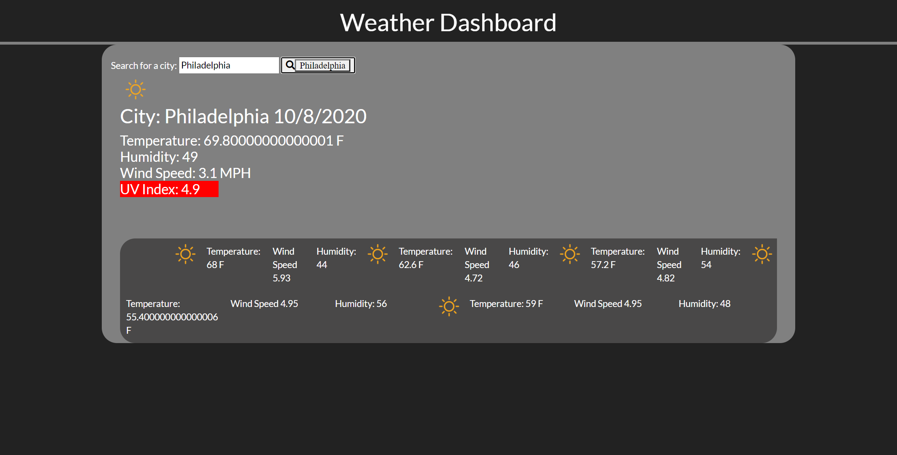

# Weather-Dashboard
<p align=center>

</p>

Link to deployed application: https://dchiev.github.io/Weather-Dashboard/

## Process

1. I started with Bootstrap components and labeled rows with ID to correspond with the element they would display. 

2. I then made an event listener on the search button that would fill in my `ingredients` value. This would then fill my API requests to the open weather api, forecast, and UV index calls. 

3. Local storage is used to display previous searches. The searches are then appended as buttons to make them clickable.

4. Within the click event, the current date is displayed with  ```new Date();```.

5. Reading through the JSON api response, I pull the date and key weather statistics.

6. To display the weather image, I run `if` and `else if` statements to display an image with the corresponding weather conditions. 

```javascript 
 var currentWeather = response.weather[0].main;

    if (currentWeather === "Clouds" ){
      var weatherImage = $("").attr("src", "./openweathermap-api-icons-master/icons/04d.png");
      weatherImage.attr("style", "height: 50px; width: 50px");
      $("#weather-image").html(weatherImage);
    }

    else if (currentWeather === "Rain" ){
      var weatherImage = $("").attr("src", "./openweathermap-api-icons-master/icons/10d.png");
      weatherImage.attr("style", "height: 50px; width: 50px");
      $("#weather-image").html(weatherImage);
    }

    else if (currentWeather === "Drizle" ){
      var weatherImage = $("").attr("src", "./openweathermap-api-icons-master/icons/09d.png");
      weatherImage.attr("style", "height: 50px; width: 50px");
      $("#weather-image").html(weatherImage);
    }

    else if (currentWeather === "Clear" ){
      var weatherImage = $("").attr("src", "./openweathermap-api-icons-master/icons/01d.png");
      weatherImage.attr("style", "height: 50px; width: 50px");
      $("#weather-image").html(weatherImage);
    }
```
7. To run the five day forecast, I do pretty much the same as above but iterate through an array five times. This gives me the five-day forecast printed on a new `<div>. 

8. Finally, to call the UV Index, I call the API with latitude and longitude from the first API to retrieve the data. 
